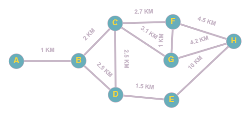

# Algoritma Dijsktra

## Apa it Algoritma Dijsktra ?
Algoritma Dijkstra adalah salah satu algoritma yang dipakai untuk memecahkan permasalahan jarak terpendek di dalam graf berarah dengan bobot garis yang bernilai non-negatif.

Algoritma Dijkstra bekerja dengan memakai strategi greedy, dimana pada setiap langkah yang dipilih merupakan sisi yang memiliki bobot terkecil yang menghubungkan sebuah simpul yang telah dipilih dengan simpul lain yang belum dipilih
## Menyelesaikan Algoritma Dijsktra menggunakan Python

silahkan klik [disini](dijsktra.py)  untuk melihat kode atau kamu bisa clone project ini.